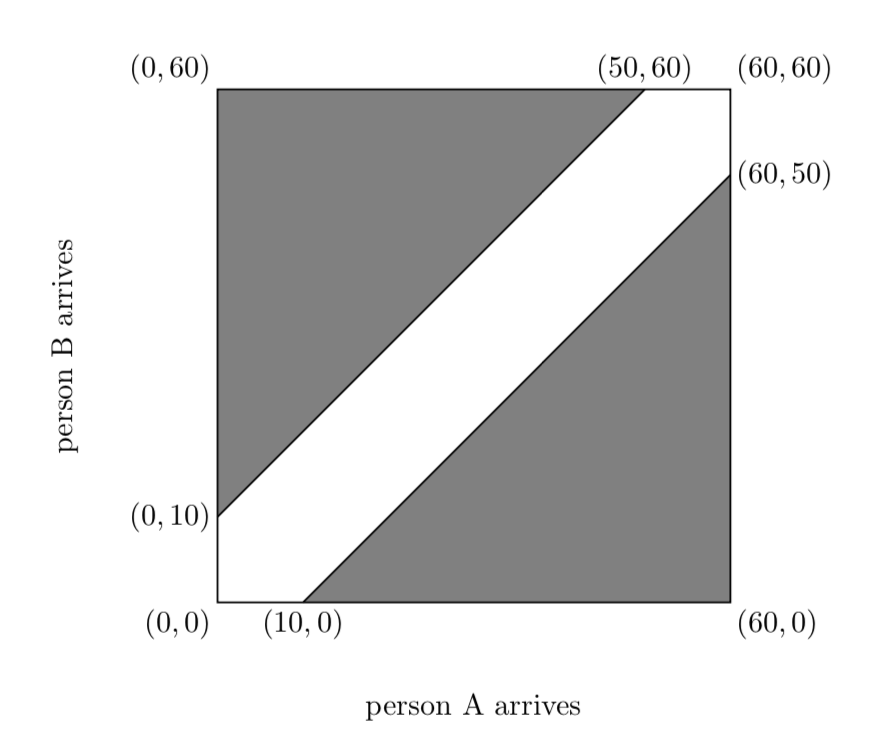

## Lecture 11: More on Probability

### Waiting problem
A and B agree to meet at a coffeee shop between 1PM and 2PM, and they arrive randomly. The rule is that no one will wait for the other more than $10$ mins. What is the probability they will meet?

Draw the time table at a unit square. See the following picture.

So the unshaded area ratio 
$$1-\frac{50*50/2}{60*60/2}=\frac{11}{36}$$

### Flipping a coin until you win
We have a coin with $p(H)=p$ and $p(T)=1-p$. Now we gonna threw this coin until we got a head. What is the expectation of steps getting a head?

* $1$-toss: getting a head with probability $p$
* $2$-toss: "TH", so the probability is $(1-p)p$
* $k$-toss: "T...TH", so get $(1-p)^{k-1}p$.
* Expected of tosses
$$E=1\cdot p+2\cdot(1-p)p+3\cdot(1-p)^2p+4\cdot (1-p)^3p+....$$

$$\frac{E}{p}=1+2\cdot(1-p)+3\cdot(1-p)^2+4\cdot (1-p)^3+....$$

$$\frac{(1-p)E}{p}=1\cdot (1-p)+2\cdot(1-p)^2+3\cdot(1-p)^3+4\cdot (1-p)^4+....$$

$$\frac{E}{p}-\frac{(1-p)E}{p}=1+(1-p)+(1-p)^2+(1-p)^3+(1-p)^4+....$$

$$E=\frac{1}{1-(1-p)}=\frac{1}{p}$$

* So if $p=\frac{1}{2}$, you expect $2$ tosses until getting a head.

### Happy meals toy collector
You keep buying happy meals until you collected the whole set of toys (a pack of 5-6 toys). How many meals do you expect to buy?

* Buying the first meal, you will get one new toy for sure, with probability 100%.
* Starting from the second meal, getting an additional new toy has probability $\frac{k-1}{k}$. The expected meals you need to buy is the same as "tossing until you win problem", so it is $\frac{k}{k-1}$. 
* Once you collected $2$ toys, getting an additional new toy has probability $\frac{k-2}{k}$. The expected meals you need to buy is the same as "tossing until you win problem", so it is $\frac{k}{k-2}$. 
* So the expected number of meals until you get all $k$ toys:
$$1+\frac{k}{k-1}+\frac{k}{k-2}+...+\frac{k}{1}=k(1+\frac{1}{2}+\frac{1}{3}+...+\frac{1}{k})$$
* $k=2$, you need $3$ meals.
* $k=3$, you need $5.5$ meals.
* $k=5$, you need $11.4$ meals.
* $k=25$, you need $95.4$ meals.
* $k=100$, you need $519$ meals.

